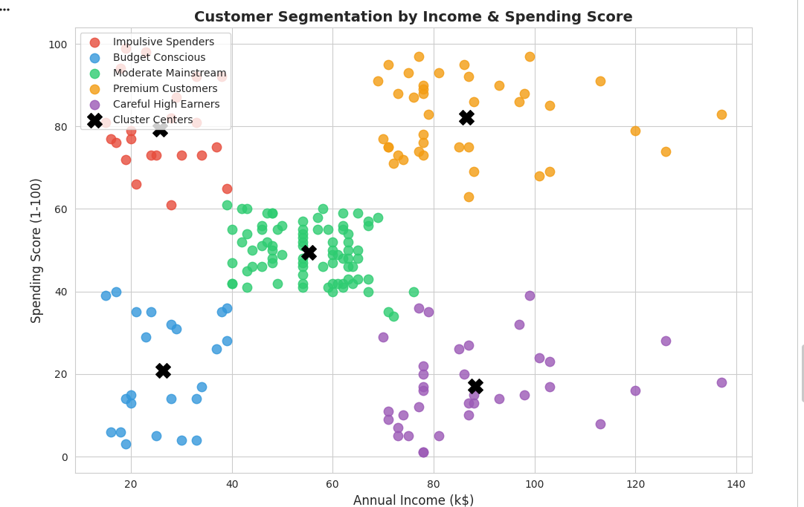
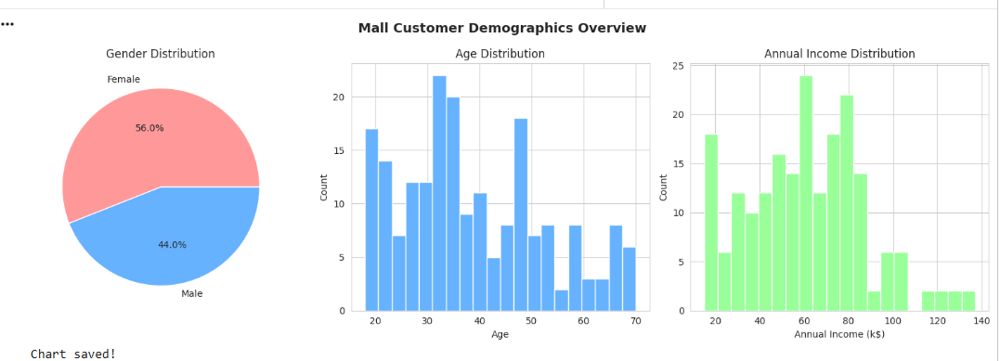
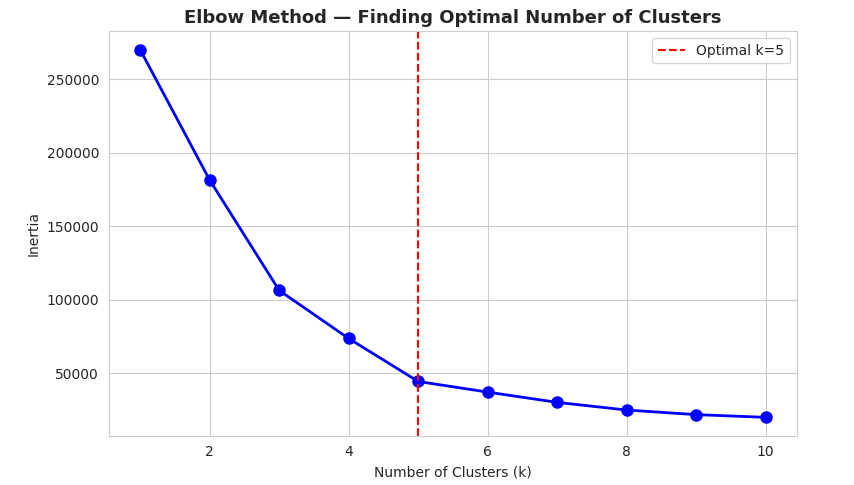
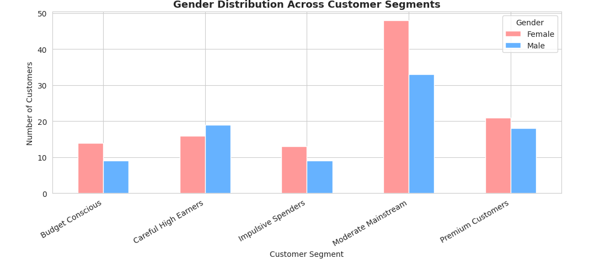

# 👥 Who Are We Losing Money Marketing To?
### A Customer Segmentation Study for Retail Marketing Strategy

**Author:** Dhrumi Kansara | MS Business Analytics, Arizona State University  
**Tools:** Python, Pandas, Scikit-learn, Matplotlib, Seaborn  
**Domain:** Marketing Analytics | Customer Intelligence  
**Dataset:** Mall Customers 200 customers, 5 variables

---

## 📋 The Business Problem

Most retail marketing budgets are split evenly across all customers or worse, spent heavily on the wrong ones. This analysis asks a harder question: **if you had a $50,000 quarterly marketing budget and 5 very different customer types, how would you split it and why?**

Using K-Means clustering, I segmented 200 mall customers into 5 distinct behavioral groups based on annual income and spending score, then built a data-driven budget allocation strategy for each.

---

## 🔍 My Approach & Key Decisions

I initially tried clustering with 3 variables Age, Income, and Spending Score. The segments were messy and overlapping. Removing Age and clustering purely on **income vs. spending behavior** produced 5 clean, interpretable groups that a marketing manager could actually act on.

The elbow method confirmed 5 as the optimal cluster count the inertia curve flattened sharply after k=5, with diminishing returns beyond that point.

---

## 📊 The 5 Customer Segments

| Segment | Count | % of Base | Avg Income | Avg Spending Score | Avg Age |
|---------|-------|-----------|-----------|-------------------|---------|
| 🟢 Premium Customers | 39 | **19.5%** | $86,500 | 82.1/100 | 33 |
| 🔵 Careful High Earners | 35 | **17.5%** | $88,200 | 17.1/100 | 41 |
| 🟡 Moderate Mainstream | 81 | **40.5%** | $55,300 | 49.5/100 | 43 |
| 🟠 Impulsive Spenders | 22 | **11.0%** | $25,700 | 79.4/100 | 25 |
| 🔴 Budget Conscious | 23 | **11.5%** | $26,300 | 20.9/100 | 45 |

---

## 💡 Key Findings

### Finding 1 — Careful High Earners are the biggest missed opportunity
This segment has the **highest average income ($88,200)** even higher than Premium Customers but a spending score of only 17.1/100. These 35 customers have money but aren't spending it here. They aren't price-sensitive; they're **trust-sensitive**. They need value education, not discounts.

### Finding 2 — Impulsive Spenders punch above their weight
With only $25,700 average income and a spending score of 79.4, this segment spends far beyond what their income would suggest. They are **emotionally driven buyers** the most responsive to urgency-based tactics like flash sales and limited-time offers. Average age of 25 makes them a long-term loyalty opportunity.

### Finding 3 — Moderate Mainstream is 40% of the base but generates average returns
The largest segment (81 customers, 40.5%) sits in the middle on both income and spending. No extreme behavior in either direction. **This is where most marketing budgets get wasted** blanketing the majority with generic promotions that don't move the needle.

### Finding 4 — Premium Customers are under-served despite being the most valuable
19.5% of customers with $86,500 income AND 82.1 spending score **these are your best customers**. High income, high willingness to spend. Yet most retail marketing focuses on acquiring new customers rather than deepening relationships with this group.

---

## 💰 $50,000 Marketing Budget Allocation

| Segment | Allocation | Amount | Strategy | Why |
|---------|-----------|--------|----------|-----|
| 🟢 Premium Customers | 34% | $17,000 | VIP events, exclusive previews, loyalty rewards | Highest ROI already spending, protect & deepen |
| 🟠 Impulsive Spenders | 26% | $13,000 | Flash sales, SMS alerts, limited-time offers | Highest spend-to-income ratio  very responsive |
| 🔵 Careful High Earners | 22% | $11,000 | Value content, trust-building, quality messaging | Biggest untapped income convert with education |
| 🟡 Moderate Mainstream | 14% | $7,000 | Bundle deals, loyalty points, mid-range promos | Large base, moderate response efficient broad reach |
| 🔴 Budget Conscious | 4% | $2,000 | Clearance events, value packs, seasonal discounts | Low income + low spending = lowest conversion potential |

> **Key insight:** Most retailers spend 40%+ of budget on the Moderate Mainstream because it's the largest group. This analysis suggests concentrating spend on Premium + Impulsive segments (60% of budget, 30.5% of customers) would generate significantly higher returns.

---

## 📈 Visualizations

### Customer Segments by Income & Spending Score

### Demographics Overview

### Elbow Curve Finding Optimal Clusters

### Gender Distribution Across Segments

---

## ✅ Business Recommendations Summary

**Short-term (0–3 months):**
- Launch a VIP program exclusively for Premium Customers invite-only, first access to new products
- Run a flash sale campaign targeting Impulsive Spenders via SMS/push notifications with 24-hour windows
- Reduce generic email blasts to Moderate Mainstream replace with personalized bundle recommendations

**Long-term (3–12 months):**
- Build a content marketing strategy for Careful High Earners quality guides, comparison content, trust signals
- Create a re-engagement campaign for Budget Conscious segment tied to clearance cycles only
- Track Impulsive Spenders (avg age 25) for loyalty conversion they have the highest long-term LTV potential as income grows

---

## 📁 Repository Files

| File | Description |
|------|-------------|
| `customer_segmentation.ipynb` | Full analysis notebook (9 cells) |
| `Mall_Customers.csv` | Raw dataset (200 customers) |
| `customer_segments.png` | K-Means cluster visualization |
| `demographics_overview.png` | Age, gender, income distributions |
| `elbow_curve.png` | Optimal cluster selection |
| `gender_by_segment.png` | Gender breakdown by segment |

---

## 🛠️ How to Reproduce

1. Open [Google Colab](https://colab.research.google.com) — free, no installation needed
2. Upload `Mall_Customers.csv`
3. Run `customer_segmentation.ipynb` cell by cell
4. All libraries (pandas, sklearn, matplotlib, seaborn) are pre-installed in Colab

---

## 🔗 Connect

**LinkedIn:** [linkedin.com/in/dhrumikansara](https://linkedin.com/in/dhrumikansara)  
**Email:** dkansar4@asu.edu  
